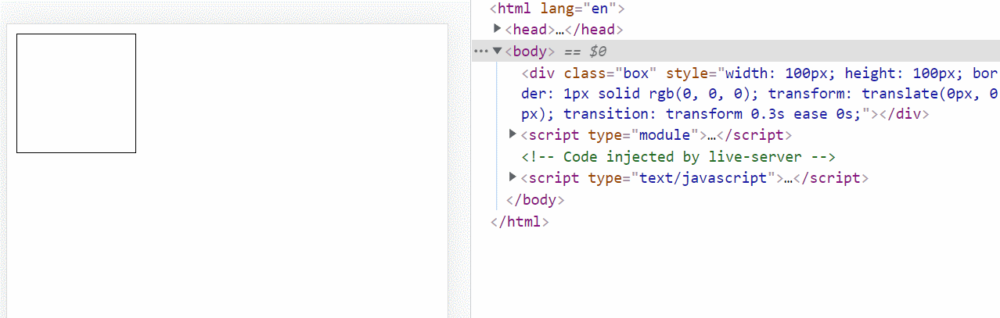
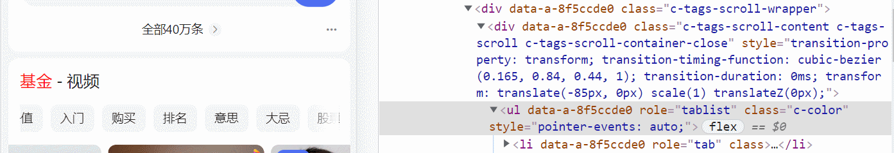

> 如果只想看解决方法，直接跳转到[第四小节](# 4	解决问题)

# 1	描述

在`ios`设备上，不管是`iPhone`还是`iPad`，不知道从什么时候开始，只要开启省电模式，`requestAimationFrame`都会锁死 `30` 帧，甚至在支持 `120` 刷新率的 `iPad Pro` 上，不开省电模式，刷新率只能到`60`，开省电模式依然雷打不动`30fps`（手上只有老款`pro`，新款不知道什么情况），在搜索引擎上搜索的时候也搜索到了[相关问题](https://popmotion.io/blog/20180104-when-ios-throttles-requestanimationframe/) 的描述

这就会导致，使用 `js` 去操作`dom`实现一些手势的时候，就会出问题特别卡的情况，而安卓就不会出现这个问题

比如下面的例子，在`Window`/`Android`下都非常流畅，但 `ios` 省电模式下和废了一样

```html
<!DOCTYPE html>
<html lang="en">

<head>
  <meta charset="UTF-8">
  <meta http-equiv="X-UA-Compatible" content="IE=edge">
  <meta name="viewport" content="width=device-width, initial-scale=1.0">
  <title>Document</title>
</head>

<body>

  <div class="box" style="width:100px;height:100px;border: 1px solid #000"></div>

  <script type="module">

    const box = document.querySelector('.box')

    const o = {
      startX: 0,
      startY: 0,
      previousX: 0,
      previousY: 0,
      currentX: 0,
      currentY: 0,
    }

    function step() {
      if (o.previousX !== o.currentX || o.previousY !== o.currentY) {
        box.style.transform = `translate(${o.currentX - o.startX}px, ${o.currentY - o.startY}px)`
        o.previousX = o.currentX
        o.previousY = o.currentY
      }

      requestAnimationFrame(step)
    }

    box.addEventListener('touchstart', (e) => {
      e.preventDefault()
      o.startX = e.touches[0].clientX
      o.startY = e.touches[0].clientY
      box.style.transition = ''
      requestAnimationFrame(step)
    })

    box.addEventListener('touchmove', (e) => {
      e.preventDefault()
      o.currentX = e.touches[0].clientX
      o.currentY = e.touches[0].clientY
    })

    box.addEventListener('touchend', (e) => {
      box.style.transition = '.3s transform ease'
      box.style.transform = 'translate(0px, 0px)'
      o.startX = 0
      o.startY = 0
      o.previousX = 0
      o.previousY = 0
      o.currentX = 0
      o.currentY = 0
    })

  </script>
</body>

</html>
```



# 2	转机

在很长的时间下，这个问题都是无解的情况，我尝试去找一些大厂的`h5`页面，试图从他们的页面中找到解决方案，但是依然都是都是没什么结果

`youtube`列表上下滚动时的`tab`的收缩


微博图标拖动手势


百度百科轮播图


事情转机在最近，在百度搜索基金的时候，我发现，有一个横向列表，明明用的也是`transform`实现手势，但是在手机上开省电模式，发现竟然和关闭省电模式没什么区别



还有这种事情？难道基金和苹果有什么py交易，我突然想到，以前用了一个库，`better-scroll`，也使用了这种方式，于是，我立马跑了一个`demo`

```html
<!DOCTYPE html>
<html lang="en">

<head>
  <meta charset="UTF-8">
  <meta http-equiv="X-UA-Compatible" content="IE=edge">
  <meta name="viewport" content="width=device-width, initial-scale=1.0">
  <title>Document</title>

  <style>
    .wrapper {
      width: 300px;
      height: 400px;
      overflow: hidden;
    }

    .content>div {
      height: 200px;
      background-color: #f5f5f5;
      border: 1px dashed #000;
    }
  </style>
  <script src="https://cdn.bootcdn.net/ajax/libs/better-scroll/2.4.1/better-scroll.js"></script>
</head>

<body>

  <div class="wrapper">
    <div class="content">
      <div>content1</div>
      <div>content2</div>
      <div>content3</div>
      <div>content4</div>
      <div>content5</div>
      <div>content6</div>
      <div>content7</div>
      <div>content8</div>
    </div>

    <script>
      new BetterScroll.default(document.querySelector('.wrapper'), { scrollY: true })
    </script>

</body>

</html>
```

神奇了，不知道 `better-scroll` 干了什么事情，`better-scroll`源码还挺大的，并不是很想看它的源码

但是巧了，之前为了体积问题，我也写过一个`React`组件，在安卓上模拟ios的弹性滚动的效果，并且在省电模式下，也能达到满帧的刷新率，运气太好了，原来答案一直就在身边，并且这个组件的代码才2，300行，看起来非常方便


并且神奇的是，浏览器执行到这个组件的时候，再切换到别的需要js手势的组件的时候，也能达到满帧的效果


# 3	查找关键代码

经过不断尝试


# 4	解决问题

主要解决代码如下

```ts
(function(){
    const b = document.createElement('div')
    b.style.pointerEvents = 'none'
    b.style.opacity = '0'
    b.style.width = '1800px'
    b.style.position = 'fixed'
    b.innerText = '.'
    document.body.appendChild(b)

    setTimeout(() => {
        b.style.transition = '1s transform'
        b.style.transform = 'translate(0)'

        setTimeout(() => {
            b.parentNode.removeChild(b)
        }, 100)

    })
})()
```

具体的例子和代码放到 `github` 上，希望能点一个`star`


